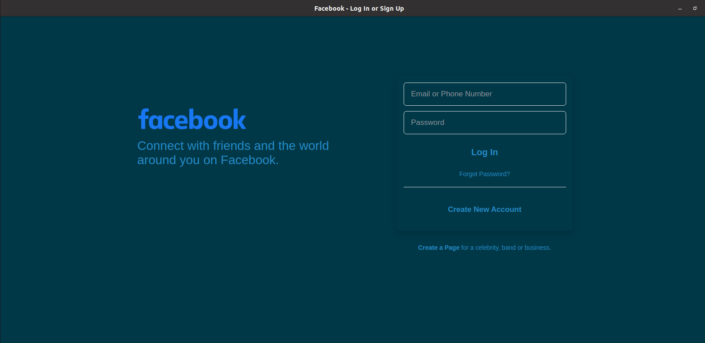

<h1>Synthetic Intelligence</h1>

Synthetic Intelligence (SI) is a full infrastructure for different type of attacks on social media such as facebook, twitter, linkedin, etc.

 
#### Browser
- [X] Undetectable automation
- [ ] Proxy rotations 
- [ ] Tor support
- [X] Credentials manager

#### Features
- [ ] Phishing page generator [YET]

#### Facebook automated life
- [X] Facebook account generator
- [X] Auto adding of proposed friends
- [X] Auto liking of posts

### Yandex
- [X] Yandex mail account generator
- [ ] Captcha image resolver [YET]

